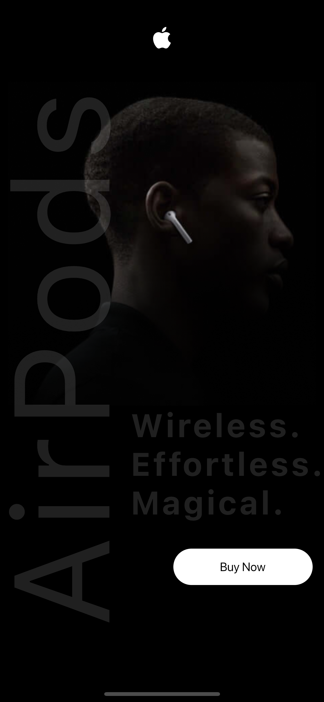
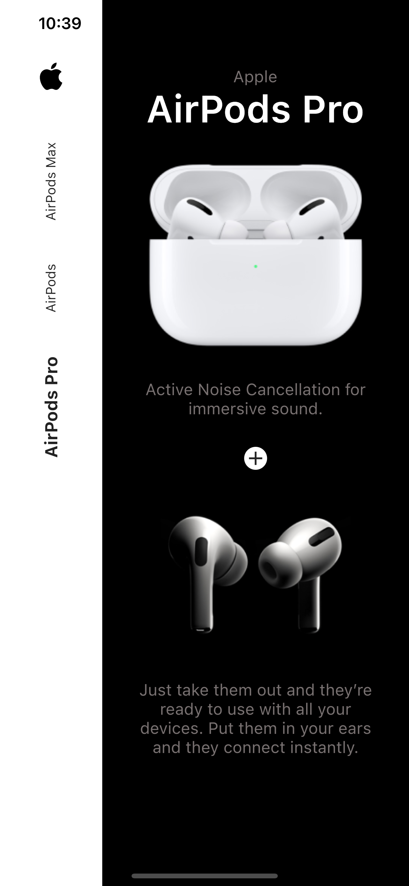
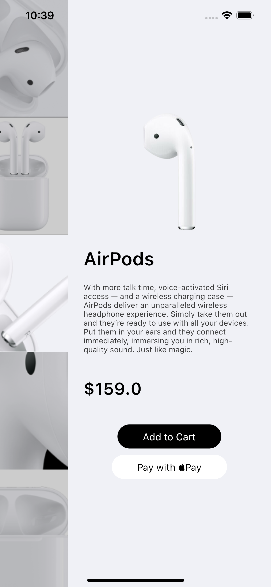
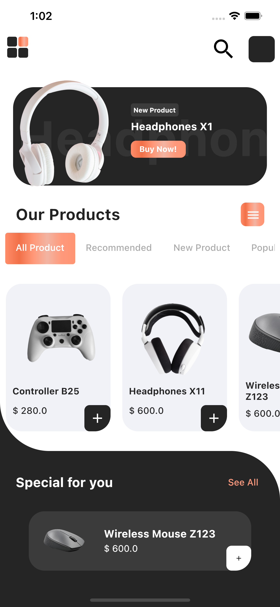
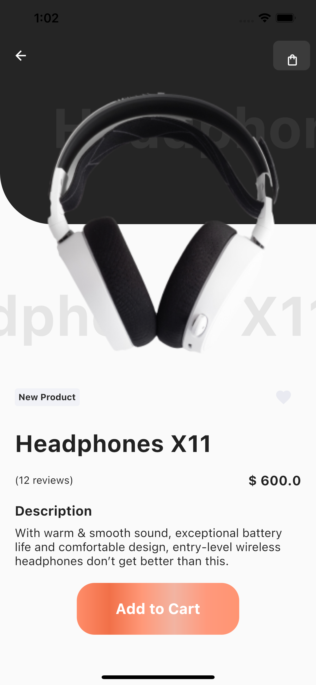

[![Contributors][contributors-shield]][contributors-url]
[![Forks][forks-shield]][forks-url]
[![Stargazers][stars-shield]][stars-url]
[![Issues][issues-shield]][issues-url]
[![MIT License][license-shield]][license-url]
[![LinkedIn][linkedin-shield]][linkedin-url]

This repo contains all the UI Concepts/Projects I worked on so far.

## Airpods Shop UI

Cross-platform UI concept for Airpods Shop app written in Flutter/Dart.
Project Link: [https://github.com/WarMac4964/Airpods-Shop-UI](https://github.com/WarMac4964/Airpods-Shop-UI)
 

  

## Shop UI Concept

Cross-platform UI concept for shopping app written in Flutter/Dart.
Project Link: [https://github.com/WarMac4964/ShopUI-Concept](https://github.com/WarMac4964/ShopUI-Concept)
 

  

## Facebook UI Clone

Cross-platform Facebook UI clone written in Flutter/Dart.
Project Link: [https://github.com/WarMac4964/facebook_clone](https://github.com/WarMac4964/facebook_clone)
 

## Contact

Anurag Tyagi - [@capttyg](https://www.instagram.com/capttyg/) - anurag.tyagi4964@gmail.com

[contributors-shield]: https://img.shields.io/github/contributors/WarMac4964/UI-Concepts.svg?style=for-the-badge
[contributors-url]: https://github.com/WarMac4964/UI-Concepts/graphs/contributors
[forks-shield]: https://img.shields.io/github/forks/WarMac4964/UI-Concepts.svg?style=for-the-badge
[forks-url]: https://github.com/WarMac4964/UI-Concepts/network/members
[stars-shield]: https://img.shields.io/github/stars/WarMac4964/UI-Concepts.svg?style=for-the-badge
[stars-url]: https://github.com/WarMac4964/UI-Concepts/stargazers
[issues-shield]: https://img.shields.io/github/issues/WarMac4964/UI-Concepts.svg?style=for-the-badge
[issues-url]: https://github.com/WarMac4964/UI-Concepts/issues
[license-shield]: https://img.shields.io/github/license/WarMac4964/UI-Concepts.svg?style=for-the-badge
[license-url]: https://github.com/WarMac4964/UI-Concepts/blob/master/LICENSE.txt
[linkedin-shield]: https://img.shields.io/badge/-LinkedIn-black.svg?style=for-the-badge&logo=linkedin&colorB=555
[linkedin-url]: https://www.linkedin.com/in/anurag-tyagi-395425178/